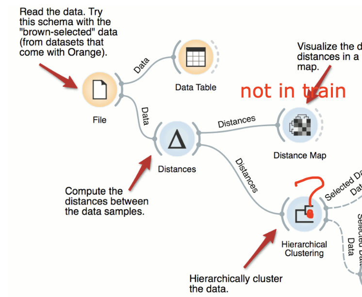  
Icons present: Data-File, Data-Data Table, Unsupervised-Distances,  
  
Text Mining-Collocations is ranked #1  
------- Unsupervised-Hierarchical Clustering is ranked #2 in the reconstructed row.  
 
----------- 
  
      
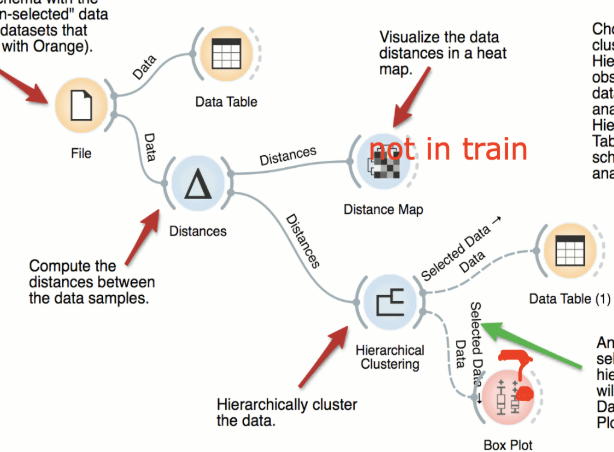  
Icons present: Data-File, Data-Data Table, Data-Data Table, Unsupervised-Distances, Unsupervised-Hierarchical Clustering,  
Target icon: Visualize-Box Plot  

Text Mining-Collocations is ranked #1  
Model-Tree is ranked #2  
------- Visualize-Box Plot is ranked #3 in the reconstructed row.  
  

-----------

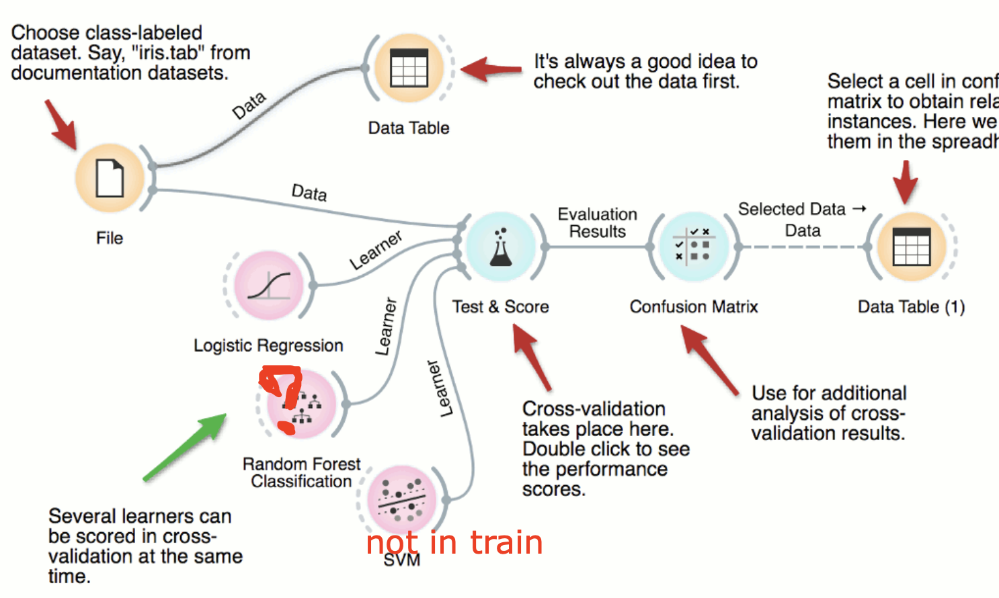  
Icons present: Data-File, Data-Data Table, Data-Data Table, Model-Logistic Regression, Evaluate-Test and Score, Evaluate-Confusion Matrix,  
Target icon: Model-Random Forest  

Text Mining-Collocations is ranked #1  
Model-Tree is ranked #2  
Unsupervised-Hierarchical Clustering is ranked #3  
Visualize-Box Plot is ranked #4  
Visualize-Distributions is ranked #5  
Visualize-Scatter Plot is ranked #6  
Unsupervised-k-Means is ranked #7  
Data-Datasets is ranked #8  
Text Mining-Concordance is ranked #9  
Text Mining-Duplicate Detection is ranked #10  
Model-Linear Regression is ranked #11  
Evaluate-Predictions is ranked #12  
Data-Paint Data is ranked #13  
Text Mining-Corpus is ranked #14  
Survival Analysis-Kaplan-Meier Plot is ranked #15  
Unsupervised-Distances is ranked #16  
Visualize-Nomogram is ranked #17  
Visualize-Tree Viewer is ranked #18  
------- Model-Random Forest is ranked #19 in the reconstructed row.  

-----------

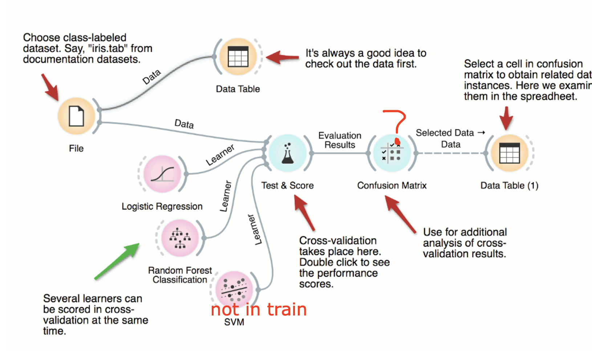  
Icons present: Data-File, Data-Data Table, Data-Data Table, Model-Logistic Regression, Evaluate-Test and Score, Model-Random Forest,  
Target icon: Evaluate-Confusion Matrix  

Text Mining-Collocations is ranked #1  
Model-Tree is ranked #2  
Unsupervised-Hierarchical Clustering is ranked #3  
Visualize-Box Plot is ranked #4  
Visualize-Distributions is ranked #5  
Unsupervised-k-Means is ranked #6  
Visualize-Scatter Plot is ranked #7  
Data-Datasets is ranked #8  
Text Mining-Concordance is ranked #9  
Model-Linear Regression is ranked #10  
Text Mining-Duplicate Detection is ranked #11  
Evaluate-Predictions is ranked #12  
Data-Paint Data is ranked #13  
Text Mining-Corpus is ranked #14  
Visualize-Nomogram is ranked #15  
Unsupervised-Distances is ranked #16  
Survival Analysis-Kaplan-Meier Plot is ranked #17  
Visualize-Tree Viewer is ranked #18  
Geo-Choropleth Map is ranked #19  
------- Evaluate-Confusion Matrix is ranked #20 in the reconstructed row.  

-----------
  
  
  
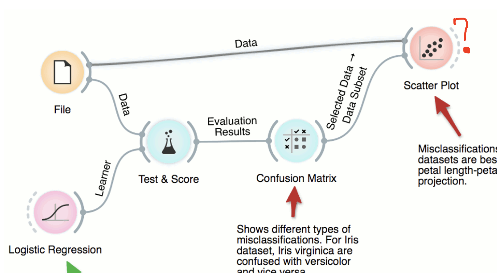  
Icons present: Data-File, Evaluate-Test and Score, Evaluate-Confusion Matrix, Model-Logistic Regression,  
Target icon: Visualize-Scatter Plot  

Text Mining-Collocations is ranked #1  
Data-Data Table is ranked #2  
Model-Tree is ranked #3  
Unsupervised-Hierarchical Clustering is ranked #4  
Visualize-Box Plot is ranked #5  
Visualize-Distributions is ranked #6  
Unsupervised-k-Means is ranked #7  
Visualize-Scatter Plot is ranked #8  
------- Visualize-Scatter Plot is ranked #8 in the reconstructed row.  

-----------
  
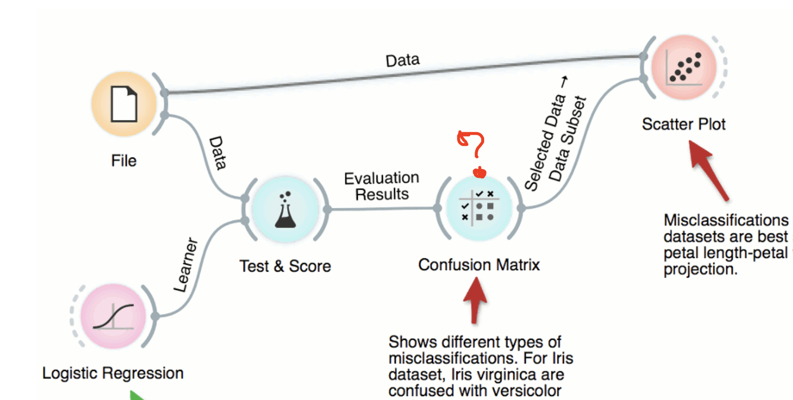  
Icons present: Data-File, Evaluate-Test and Score, Model-Logistic Regression,  
Target icon: Evaluate-Confusion Matrix
  
Text Mining-Collocations is ranked #1  
Data-Data Table is ranked #2  
Unsupervised-Hierarchical Clustering is ranked #3  
Model-Tree is ranked #4  
Visualize-Box Plot is ranked #5  
Visualize-Distributions is ranked #6  
Visualize-Scatter Plot is ranked #7  
Unsupervised-k-Means is ranked #8  
Data-Datasets is ranked #9  
Text Mining-Duplicate Detection is ranked #10  
Text Mining-Concordance is ranked #11  
Model-Linear Regression is ranked #12  
Evaluate-Predictions is ranked #13  
Data-Paint Data is ranked #14  
Text Mining-Corpus is ranked #15  
Unsupervised-Distances is ranked #16  
Survival Analysis-Kaplan-Meier Plot is ranked #17  
Visualize-Nomogram is ranked #18  
Visualize-Tree Viewer is ranked #19  
Model-Random Forest is ranked #20  
Geo-Choropleth Map is ranked #21  
------- Evaluate-Confusion Matrix is ranked #22 in the reconstructed row.  

----------- 
  
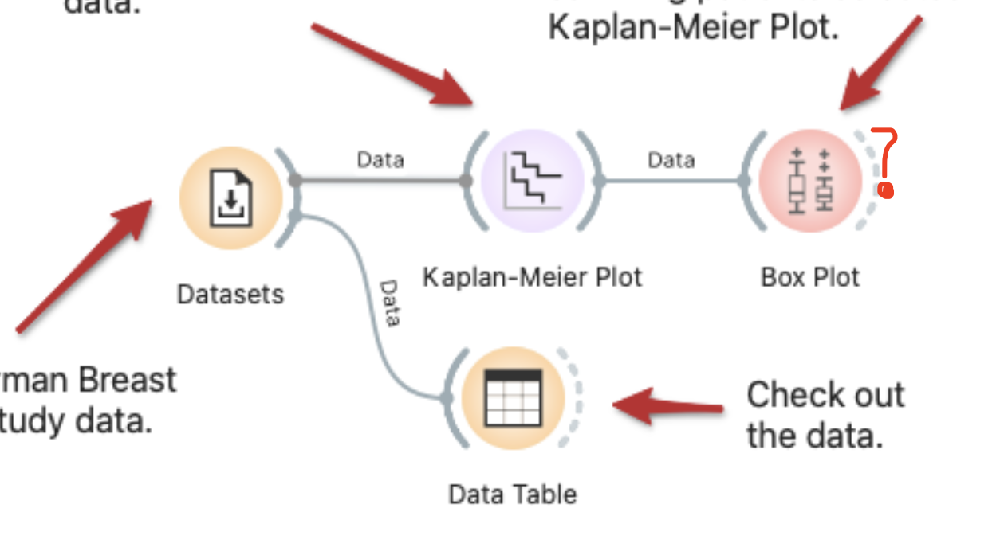  
Icons present: Data-Datasets, Survival Analysis-Kaplan-Meier Plot, Data-Data Table,  
Target icon: Visualize-Box Plot  

Text Mining-Collocations is ranked #1  
Model-Tree is ranked #2  
Unsupervised-Hierarchical Clustering is ranked #3  
------- Visualize-Box Plot is ranked #4 in the reconstructed row.  

-----------
  
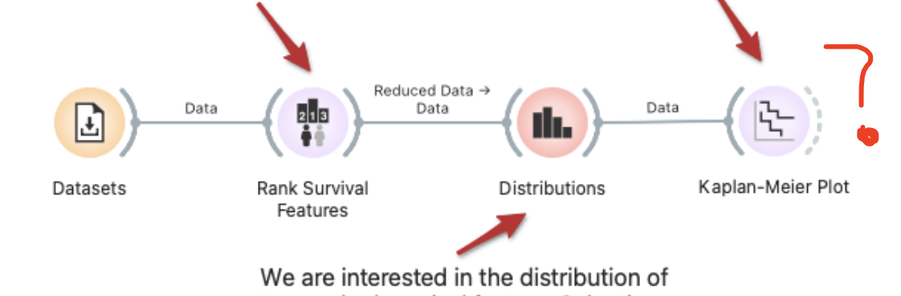  
Icons present: Data-Datasets, Visualize-Distributions, Survival Analysis-Rank Survival Features,  
Target icon: Survival Analysis-Kaplan-Meier Plot 
 
Text Mining-Collocations is ranked #1  
Data-Data Table is ranked #2  
Model-Tree is ranked #3  
Unsupervised-Hierarchical Clustering is ranked #4  
Visualize-Box Plot is ranked #5  
Unsupervised-k-Means is ranked #6  
Visualize-Scatter Plot is ranked #7  
Evaluate-Test and Score is ranked #8  
Text Mining-Duplicate Detection is ranked #9  
Model-Linear Regression is ranked #10  
Text Mining-Concordance is ranked #11  
Model-Logistic Regression is ranked #12  
Evaluate-Predictions is ranked #13  
Data-Paint Data is ranked #14  
Data-File is ranked #15  
Text Mining-Corpus is ranked #16  
------- Survival Analysis-Kaplan-Meier Plot is ranked #17 in the reconstructed row.  

-----------

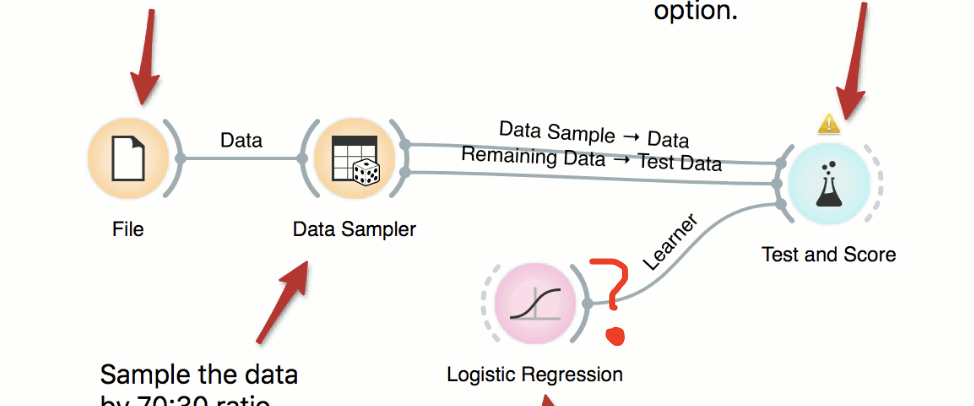
Icons present: Data-File, Evaluate-Test and Score, Transform-Data Sampler,
Target icon: Model-Logistic Regression

Text Mining-Collocations is ranked #1  
Data-Data Table is ranked #2  
Model-Tree is ranked #3  
Unsupervised-Hierarchical Clustering is ranked #4  
Visualize-Box Plot is ranked #5  
Visualize-Distributions is ranked #6  
Unsupervised-k-Means is ranked #7  
Visualize-Scatter Plot is ranked #8  
Text Mining-Concordance is ranked #9  
------- Model-Logistic Regression is ranked #10 in the reconstructed row.  

-----------

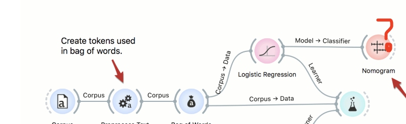
Icons present: Text Mining-Corpus, Text Mining-Preprocess Text, Text Mining-Bag of Words,
Target icon: Visualize-Nomogram

Text Mining-Collocations is ranked #1  
Data-Data Table is ranked #2  
Model-Tree is ranked #3  
Unsupervised-Hierarchical Clustering is ranked #4  
Visualize-Box Plot is ranked #5  
Visualize-Distributions is ranked #6  
Visualize-Scatter Plot is ranked #7  
Unsupervised-k-Means is ranked #8  
Text Mining-Duplicate Detection is ranked #9  
Evaluate-Test and Score is ranked #10  
Data-Datasets is ranked #11  
Model-Linear Regression is ranked #12  
Evaluate-Predictions is ranked #13  
Text Mining-Concordance is ranked #14  
Model-Logistic Regression is ranked #15  
Data-Paint Data is ranked #16  
Data-File is ranked #17  
Survival Analysis-Kaplan-Meier Plot is ranked #18  
Unsupervised-Distances is ranked #19  
------- Visualize-Nomogram is ranked #20 in the reconstructed row.  

-----------

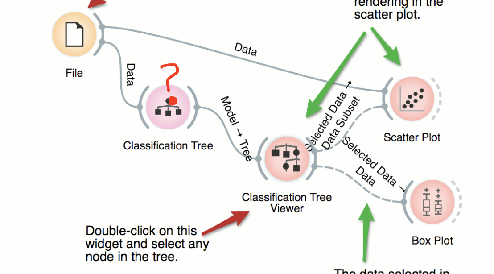
Icons present: Data-File, Visualize-Tree Viewer, Visualize-Scatter Plot, Visualize-Box Plot,  
Target icon: Model-Tree

Text Mining-Collocations is ranked #1  
Data-Data Table is ranked #2  
------- Model-Tree is ranked #3 in the reconstructed row.  

-----------

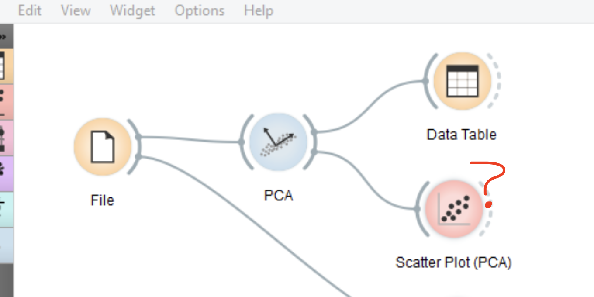
Icons present: Data-File, Data-Data Table, Unsupervised-PCA,  
Target icon: Visualize-Scatter Plot  

Text Mining-Collocations is ranked #1  
Unsupervised-Hierarchical Clustering is ranked #2  
Model-Tree is ranked #3  
Visualize-Box Plot is ranked #4  
Visualize-Distributions is ranked #5  
Unsupervised-k-Means is ranked #6  
------- Visualize-Scatter Plot is ranked #7 in the reconstructed row.  
