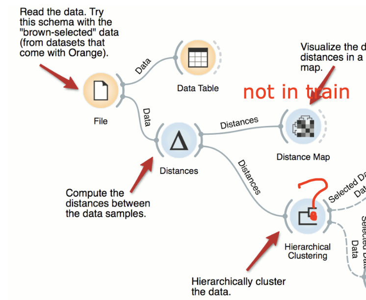
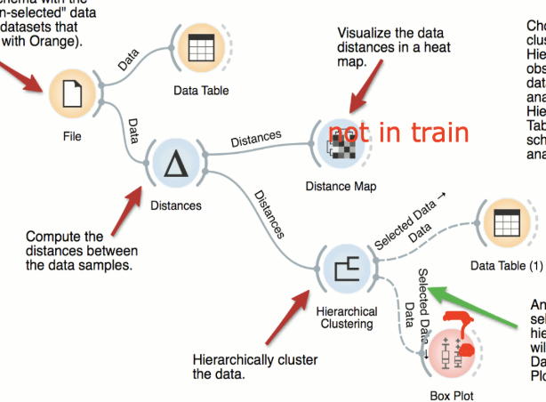
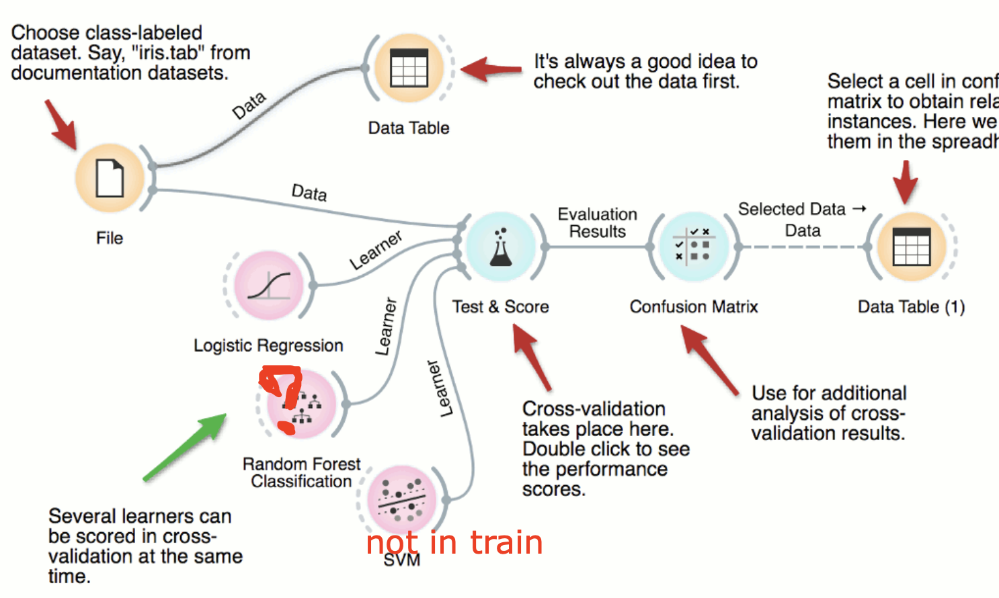
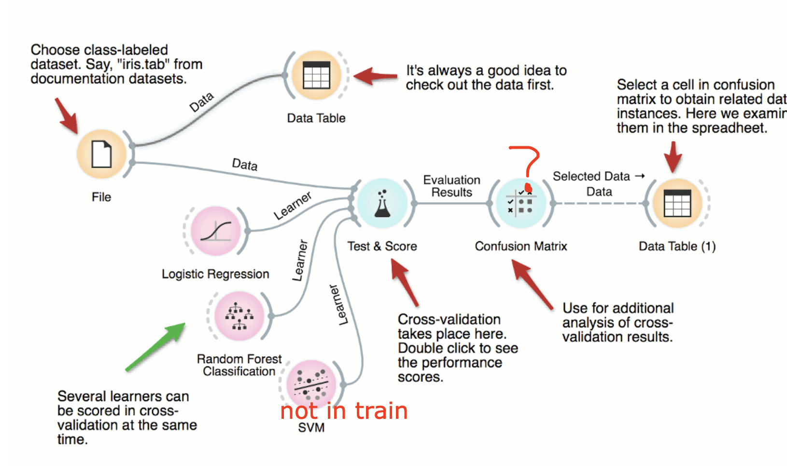
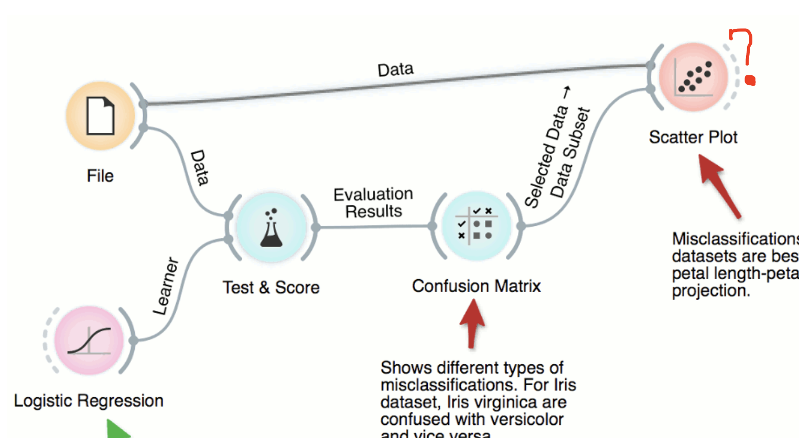
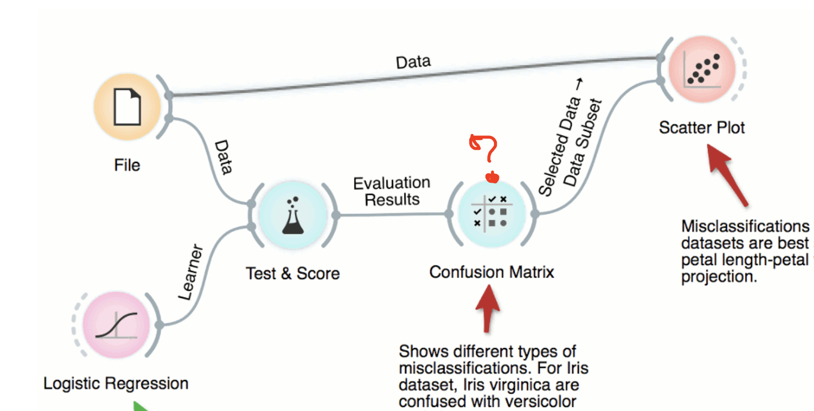
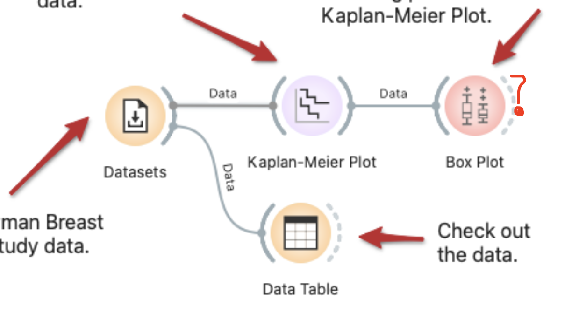
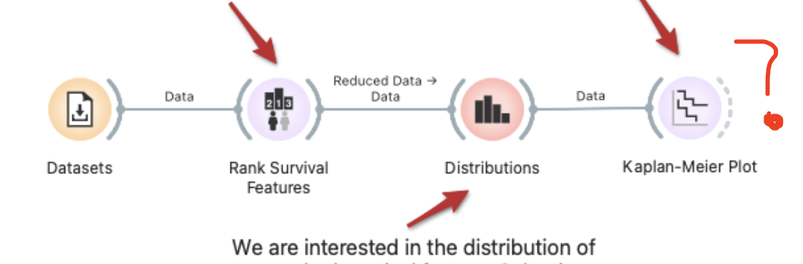

  
Icons present: Data-File, Data-Data Table, Unsupervised-Distances,  
  
Target icon: Unsupervised-Hierarchical Clustering  
Text Mining-Collocations is ranked #1  
  
'-------' Unsupervised-Hierarchical Clustering is ranked #2 in the reconstructed row.  
 
----------- 
  
      
  
Icons present: Data-File, Data-Data Table, Data-Data Table, Unsupervised-Distances, Unsupervised-Hierarchical Clustering,  
Target icon: Visualize-Box Plot  
Text Mining-Collocations is ranked #1  
Model-Tree is ranked #2  
'-------' Visualize-Box Plot is ranked #3 in the reconstructed row.  
  

-----------

  
Icons present: Data-File, Data-Data Table, Data-Data Table, Model-Logistic Regression, Evaluate-Test and Score, Evaluate-Confusion Matrix,  
Target icon: Model-Random Forest  
  
Text Mining-Collocations is ranked #1  
Model-Tree is ranked #2  
Unsupervised-Hierarchical Clustering is ranked #3  
Visualize-Box Plot is ranked #4  
Data-Datasets is ranked #5  
Visualize-Scatter Plot is ranked #6  
Visualize-Distributions is ranked #7  
Data-Paint Data is ranked #8  
Model-Linear Regression is ranked #9  
Unsupervised-Distances is ranked #10  
Text Mining-Concordance is ranked #11  
Evaluate-Predictions is ranked #12  
Unsupervised-k-Means is ranked #13  
Text Mining-Corpus is ranked #14  
Visualize-Tree Viewer is ranked #15  
Transform-Data Sampler is ranked #16  
'-------' Model-Random Forest is ranked #17 in the reconstructed row.  

-----------

  
Icons present: Data-File, Data-Data Table, Data-Data Table, Model-Logistic Regression, Evaluate-Test and Score, Model-Random Forest,  
Target icon: Evaluate-Confusion Matrix  

Text Mining-Collocations is ranked #1  
Unsupervised-Hierarchical Clustering is ranked #2  
Model-Tree is ranked #3  
Visualize-Box Plot is ranked #4  
Data-Datasets is ranked #5  
Visualize-Distributions is ranked #6  
Visualize-Scatter Plot is ranked #7  
Data-Paint Data is ranked #8  
Unsupervised-Distances is ranked #9  
Model-Linear Regression is ranked #10  
Text Mining-Concordance is ranked #11  
Evaluate-Predictions is ranked #12  
Unsupervised-k-Means is ranked #13  
Text Mining-Corpus is ranked #14  
Visualize-Tree Viewer is ranked #15  
Transform-Data Sampler is ranked #16  
Text Mining-Duplicate Detection is ranked #17  
Survival Analysis-As Survival Data is ranked #18  
Bioinformatics-Gene Sets is ranked #19  
Survival Analysis-Kaplan-Meier Plot is ranked #20  
Visualize-Nomogram is ranked #21  
Geo-Choropleth Map is ranked #22  
'-------' Evaluate-Confusion Matrix is ranked #23 in the reconstructed row.  

-----------
  
  
  
  
Icons present: Data-File, Evaluate-Test and Score, Evaluate-Confusion Matrix, Model-Logistic Regression,  
Target icon: Visualize-Scatter Plot  
Text Mining-Collocations is ranked #1  
Data-Data Table is ranked #2  
Unsupervised-Hierarchical Clustering is ranked #3  
Model-Tree is ranked #4  
Visualize-Box Plot is ranked #5  
Data-Datasets is ranked #6  
Visualize-Scatter Plot is ranked #7  

------- Visualize-Scatter Plot is ranked #7 in the reconstructed row.

-----------
  
  
Icons present: Data-File, Evaluate-Test and Score, Model-Logistic Regression,  
Target icon: Evaluate-Confusion Matrix
  
Text Mining-Collocations is ranked #1  
Data-Data Table is ranked #2  
Unsupervised-Hierarchical Clustering is ranked #3  
Model-Tree is ranked #4  
Visualize-Box Plot is ranked #5  
Data-Datasets is ranked #6  
Visualize-Distributions is ranked #7  
Visualize-Scatter Plot is ranked #8  
Data-Paint Data is ranked #9  
Unsupervised-Distances is ranked #10  
Model-Linear Regression is ranked #11  
Text Mining-Concordance is ranked #12  
Evaluate-Predictions is ranked #13  
Unsupervised-k-Means is ranked #14  
Text Mining-Corpus is ranked #15  
Visualize-Tree Viewer is ranked #16  
Model-Random Forest is ranked #17  
Text Mining-Duplicate Detection is ranked #18  
Survival Analysis-As Survival Data is ranked #19  
Transform-Data Sampler is ranked #20  
Bioinformatics-Gene Sets is ranked #21  
Survival Analysis-Kaplan-Meier Plot is ranked #22  
Visualize-Nomogram is ranked #23  
Geo-Choropleth Map is ranked #24  
Text Mining-Preprocess Text is ranked #25  
Unsupervised-PCA is ranked #26  
'-------' Evaluate-Confusion Matrix is ranked #27 in the reconstructed row.  

----------- 
  
  
Icons present: Data-Datasets, Survival Analysis-Kaplan-Meier Plot, Data-Data Table,  
Target icon: Visualize-Box Plot  

Text Mining-Collocations is ranked #1  
Unsupervised-Hierarchical Clustering is ranked #2  
Model-Tree is ranked #3  
'-------' Visualize-Box Plot is ranked #4 in the reconstructed row.  

-----------
  
  
Icons present: Data-Datasets, Visualize-Distributions, Survival Analysis-Rank Survival Features,  
Target icon: Survival Analysis-Kaplan-Meier Plot 
 
Text Mining-Collocations is ranked #1  
Data-Data Table is ranked #2  
Unsupervised-Hierarchical Clustering is ranked #3  
Model-Tree is ranked #4  
Visualize-Box Plot is ranked #5  
Model-Logistic Regression is ranked #6  
Visualize-Scatter Plot is ranked #7  
Evaluate-Test and Score is ranked #8  
Data-Paint Data is ranked #9  
Unsupervised-Distances is ranked #10  
Model-Linear Regression is ranked #11  
Data-File is ranked #12  
Text Mining-Concordance is ranked #13  
Evaluate-Predictions is ranked #14  
Unsupervised-k-Means is ranked #15  
Text Mining-Corpus is ranked #16  
Model-Random Forest is ranked #17  
Bioinformatics-Gene Sets is ranked #18  
Visualize-Tree Viewer is ranked #19  
Transform-Data Sampler is ranked #20  
Text Mining-Duplicate Detection is ranked #21  
Survival Analysis-As Survival Data is ranked #22  
Visualize-Nomogram is ranked #23  
Text Mining-Preprocess Text is ranked #24  
Geo-Choropleth Map is ranked #25  
Survival Analysis-Kaplan-Meier Plot is ranked #26  
'-------' Survival Analysis-Kaplan-Meier Plot is ranked #26 in the reconstructed row.